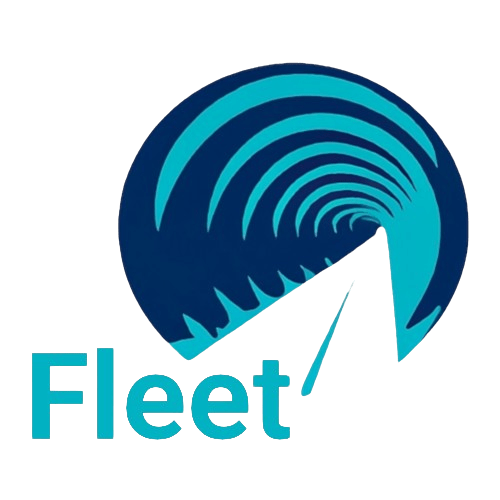
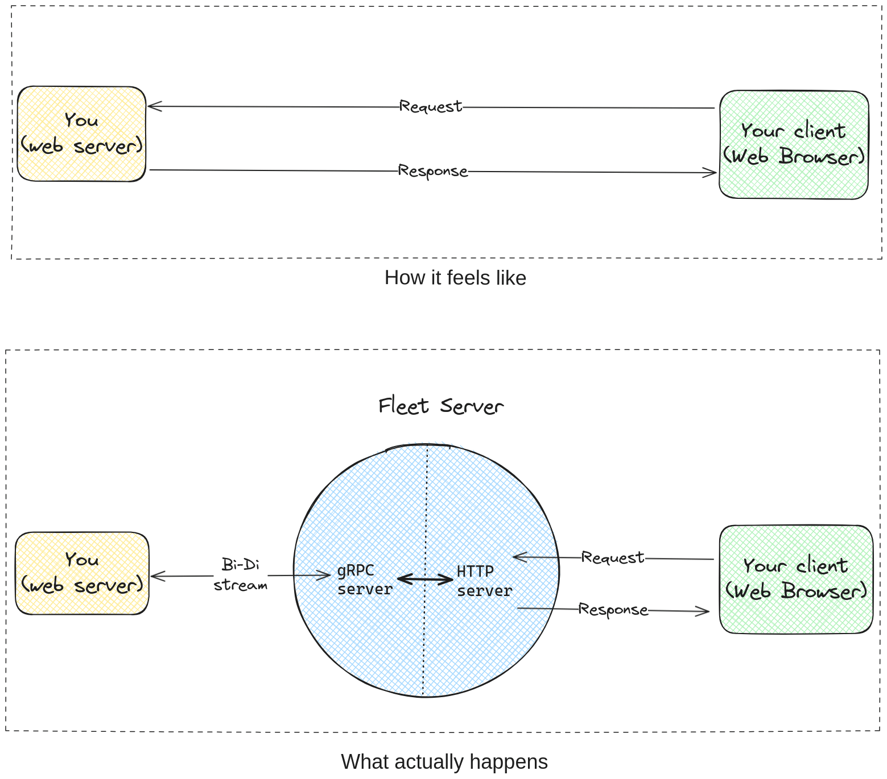

  Ephemeral HTTP API tunnel

  

---

  

  

  

  

  

  

  

## Features

* Ephemeral
* Zero-effort TLS
* No hole-punching or port forwarding required
* Fast

## Demo - serve static files

## Demo - proxy requests to local running server

## SDK

Explore the provided [examples](./example), and for a comprehensive API
reference, please visit
[GoDoc](https://godoc.org/github.com/murtaza-u/fleet).

## Architecture

